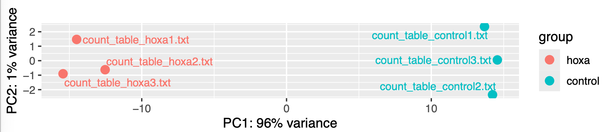

# Bioinformatics Coursework: Gene Expression and FOXL2 Structure

Selected work from **5BBB0226 - Principles of Bioinformatics (2025-26)**. This portfolio brings together two completed coursework reports: sequence and RNA-seq analysis, and a structural and functional investigation of human FOXL2.

I used established bioinformatics tools to compare sequences, interpret gene-expression data, explore genome annotations and assess protein models. The repository contains concise reports, figures extracted from my submitted work, and the FOXL2 query sequence.

## Questions, data and methods

| Study | Question | Data used | Main tools and methods |
| --- | --- | --- | --- |
| TFAP2B isoforms | How do two protein isoforms differ? | Course-provided sequences of 198 and 460 amino acids | Pairwise sequence alignment and domain interpretation |
| HOXA1 depletion | How do expression profiles differ between control and depleted samples? | Six course-provided RNA-seq count files: three control and three HOXA1-depleted samples; attributed in the coursework to Trapnell et al. (2012) | Galaxy DESeq2, MA plot, PCA and sample-distance heatmap |
| Genome exploration | How can annotations and read alignments be interpreted? | BCL11A annotations on hg38/mm39; course-provided BCR-region WGS reads on hg19 | UCSC Genome Browser and IGV |
| Human FOXL2 | Which regions can be modelled with confidence, and how does structure relate to function? | UniProt P58012, a 376-residue query; PDB templates and an AlphaFold model | BLASTP, SWISS-MODEL, T-Coffee, AlphaFold DB, PyMOL, MolProbity, InterPro, UniProt and STRING |

## Selected results

- **RNA-seq:** the saved PCA plot separates the two groups along PC1, labelled **96% of variance**; PC2 accounts for 1%. The distance heatmap also groups samples by condition. The report records **8,369 genes at raw p < 0.05**; this count has not been recalculated and is not an FDR-controlled count.
- **FOXL2 template search:** the saved BLAST table shows **100% identity and 100% query coverage for 7VOU chain C**, using the 95-residue domain query. This does not describe coverage of the full protein.
- **FOXL2 model confidence:** the saved AlphaFold summary for **AF-P58012-F1-v6** reports mean pLDDT **60.12**, with 17.3% of residues in the very-high-confidence category.
- **Structural comparison:** the saved PyMOL console reports **RMSD 0.094 Å over 582 retained atom pairs after outlier rejection** for an 8VFZ-based model against its template. This is agreement with the template, not independent proof that the model is accurate.
- **Functional interpretation:** the saved STRING network links FOXL2 with reproductive and transcriptional regulators, including SMAD3, NR5A1, SOX9 and DMRT1. Network associations are not presented as proof of direct physical interaction.



*Original figure from Coursework 1, PDF page 6. The variance percentages are read from the saved plot; the analysis was not rerun for this portfolio.*

## Read the reports

- [Sequence, RNA-seq and genome-browser analysis](reports/01-sequence-expression-and-genome-analysis.md)
- [FOXL2 structure and function](reports/02-foxl2-structure-and-function.md)
- [Evidence notes and unresolved discrepancies](EVIDENCE_NOTES.md)
- [Data availability and reproduction requirements](REPRODUCIBILITY.md)

The main structural takeaway is the need to distinguish the conserved domain from the rest of the protein when interpreting coverage, confidence and model comparisons. Exact historical outputs and their limits are documented in the reports.

## Repository contents

```text
bioinformatics-coursework/
├── README.md
├── EVIDENCE_NOTES.md
├── REPRODUCIBILITY.md
├── reports/
│   ├── 01-sequence-expression-and-genome-analysis.md
│   └── 02-foxl2-structure-and-function.md
├── figures/                 # Original images extracted from the submitted PDFs
├── data/foxl2_query.fasta    # Query sequence transcribed from Coursework 2
└── results/
    ├── reported_results.json
    └── figure_provenance.json
```

## Scope and provenance

This is a **report-based portfolio**, not an executable analysis pipeline. The source PDFs were `Coursework1_POB_2026-4.pdf` (11 pages) and `5BBB0226 Principles of Bioinformatics.pdf` (22 pages). Page references use PDF page numbers starting at 1.

The coursework analysis and saved figures predate this portfolio. AI assistance was used to extract figures, organise the repository, draft summaries and check consistency between text and figures. No new RNA-seq analysis, alignment, structure prediction or variant calling is claimed. Some conflicting statements were excluded from the headline results and documented explicitly.

Full assessment sheets, student identifiers and staff contact details are not included in this portfolio. The source PDFs remain unchanged. Figures retain their original software/database attribution; this repository does not assign a new licence to third-party material.
