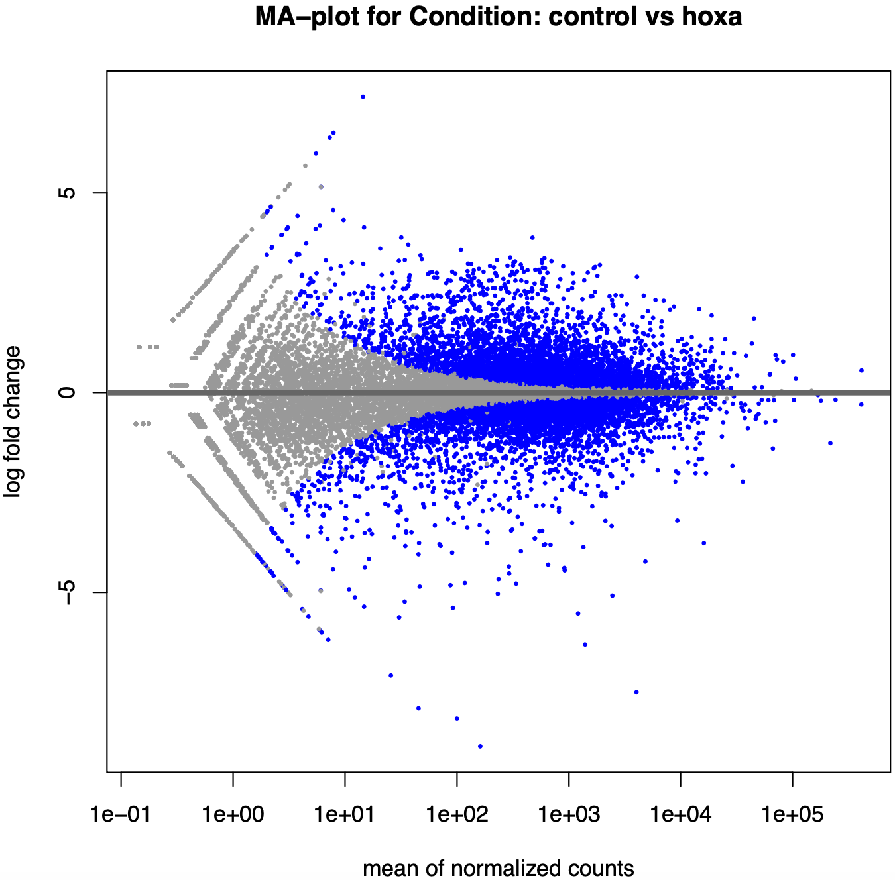
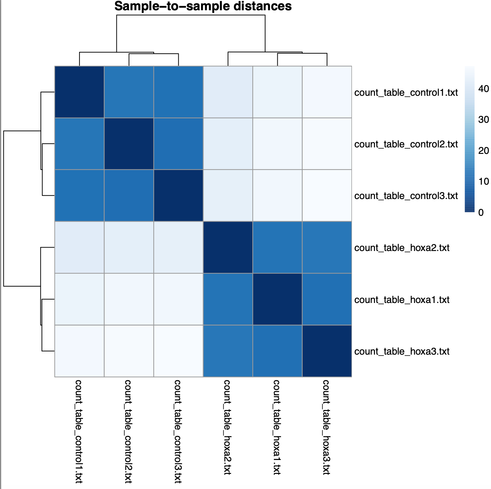

# Sequence, expression and genome-browser analysis

Source: `Coursework1_POB_2026-4.pdf`. This summary describes the submitted work; it does not rerun its analyses.

## TFAP2B isoform comparison

**Question.** How does the shorter isoform differ from the longer protein, particularly around the domain specified in the exercise?

**Data and method.** The supplied protein sequences are labelled ENST00000344788.7 (198 aa) and ENST00000393655.4 (460 aa). The report contains a pairwise alignment and interprets the missing C-terminal region relative to PF03299 (course-specified residues 230-424 of the longer sequence).

**Result.** The displayed alignment shows substantial N-terminal matching and a large C-terminal gap in the shorter sequence. The prose reports identity of 189/469 and similarity of 188/469, both as 40.3%. Those figures are internally inconsistent: 188/469 is approximately 40.1%, and the tool's summary header is not present. Exact percentages are therefore left unresolved rather than promoted as verified results. The report's word “insertion” for the missing shorter-isoform region is also not retained.

Source pages: 2-5.

## HOXA1 RNA-seq analysis

**Question.** How do the expression profiles of control and HOXA1-depleted lung fibroblast samples differ?

**Data.** Six supplied count tables, described in the assessment as coming from a Trapnell et al. (2012) study. The saved plot labels identify three `control` and three `hoxa` samples. Original count files and the Galaxy history were not supplied with these PDFs.

**Method.** The completed report describes DESeq2 in Galaxy and includes an MA plot, PCA and sample-distance heatmap.

**Results supported by the saved material.**

- The report states 8,369 genes with **raw p-value < 0.05**. This is a transcription of the reported count, not a recalculation or an adjusted-p-value result.
- The PCA labels PC1 as 96% and PC2 as 1% of variance. Control and depleted samples separate along PC1.
- The heatmap shows shorter within-group than between-group distances.
- A separate total of 2,035 genes is associated with conflicting filters in the prose: `log2FoldChange > 1` and `padj < 0.05` together with `abs(log2FoldChange) > 1`. The appropriate interpretation requires the result table or Galaxy history.

*Source: PDF page 6. The plot title says “control vs hoxa”; the actual DESeq2 contrast must be recovered before interpreting positive fold change as upregulation in either group.*

*Source: PDF page 6. Separation is a feature of the saved plot; it does not alone rule out batch effects.*

*Source: PDF page 7.*

## Genome annotation and read inspection

The UCSC exercise compares BCL11A on human hg38 and mouse mm39, including strand, transcript annotation, domains and regulatory tracks. The report records 12 human and 6 mouse transcripts, but does not preserve the GENCODE release or full transcript list. These are historical reported counts, not current annotation claims.

The IGV exercise uses the course's `cw1.bam` and `cw1.bam.bai` against hg19 to inspect the BCR region. It discusses read coverage, base mismatches, strand orientation and the region chr22:23,628,068-23,638,060.

The report claims five supported SNVs and possible homozygosity. The available overview screenshot does not provide per-site read counts, allele fractions, base qualities or mapping qualities sufficient to check those conclusions. The portfolio therefore presents this as a read-interpretation exercise, not a validated variant call set. No deletion is asserted from uneven coverage alone.

Source pages: 7-11. See [evidence notes](../EVIDENCE_NOTES.md) for the specific issues to revisit.
