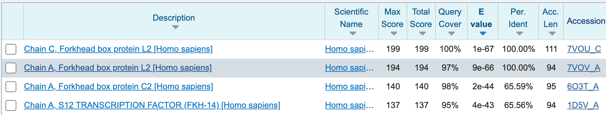
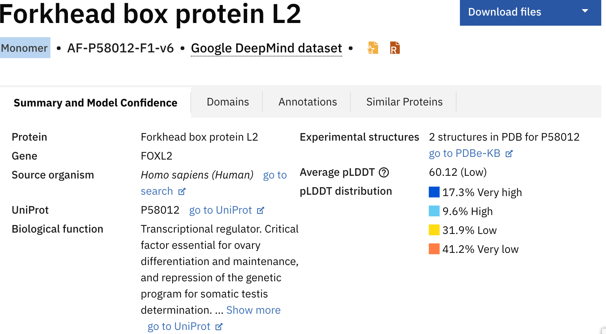
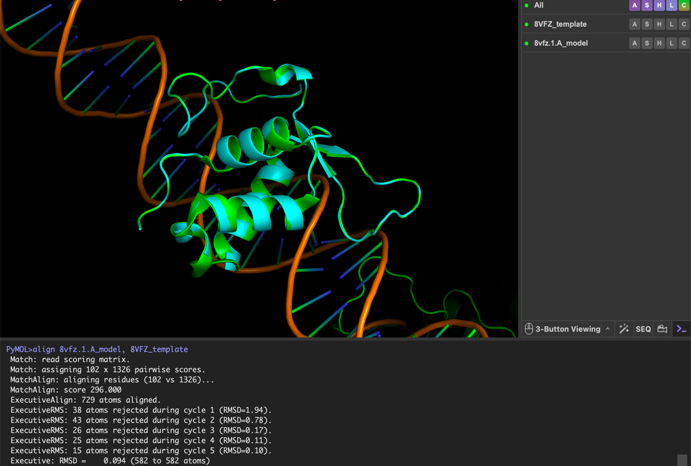
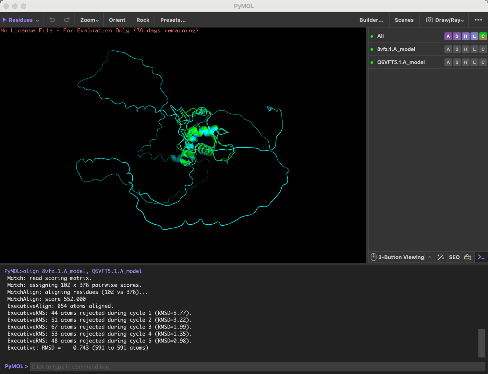
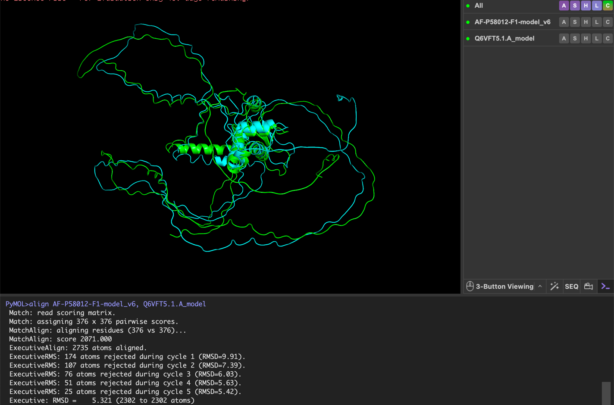
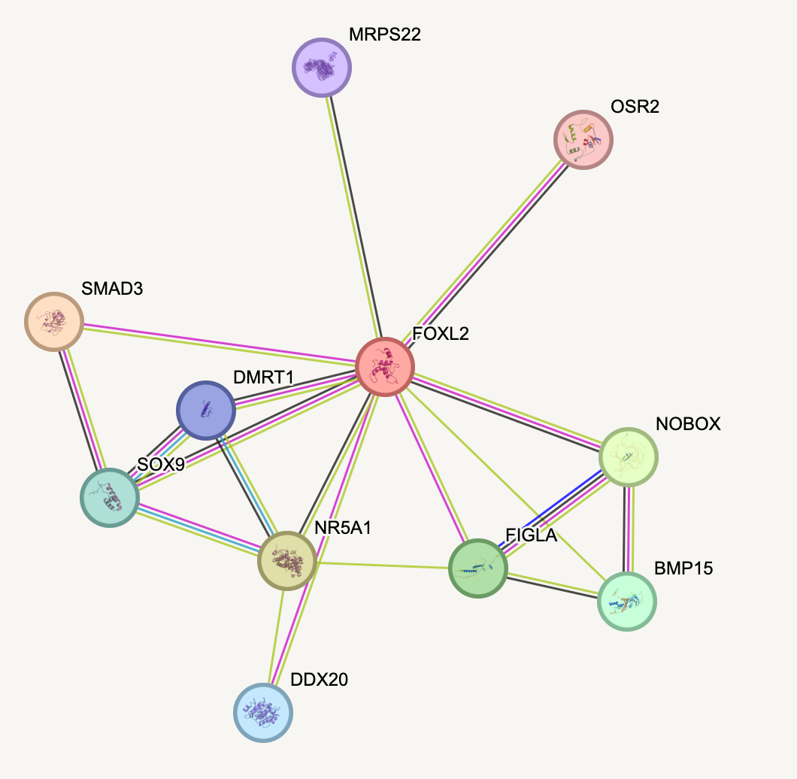

# Structural and functional investigation of human FOXL2

Source: `5BBB0226 Principles of Bioinformatics.pdf`. Numerical outputs below are preserved from the completed report and its screenshots, not regenerated analyses.

## Question and input

Which parts of FOXL2 can be described with structural confidence, and how do the sequence, model and functional annotations fit together?

The supplied query is human FOXL2, UniProt **P58012**, with **376 amino acids**. The sequence was extracted from PDF page 2 into [`foxl2_query.fasta`](../data/foxl2_query.fasta); its length and amino-acid alphabet were checked. It was not refetched from UniProt.

The report's saved UniProt annotation identifies a DNA-binding region at **54-148** (page 18, Figure 16), also the **95-residue** BLAST query described on page 3. This resolves the internal discrepancy with the different range stated on page 2 for the purposes of this summary; it is not a fresh database verification.

## Workflow

1. Identify the sequence and review UniProt and InterPro annotations.
2. Search for SWISS-MODEL templates and compare their identity and coverage.
3. Search the PDB with BLASTP using the 95-residue domain query.
4. Compare query and template sequences using T-Coffee.
5. Inspect the AlphaFold model and its confidence/PAE displays.
6. Compare model structures and templates in PyMOL.
7. Review geometry using MolProbity.
8. Interpret the saved STRING association network alongside the functional annotations.

## Template search

The report describes a Q6VFT5-based model with 97.61% sequence identity and GMQE 0.59, and domain-limited models based on 8VFZ and 1D5V with GMQE 0.19 and 0.13. These SWISS-MODEL metrics are report-text values; the corresponding complete job exports were not provided.

The saved BLAST screenshot supports:

| Hit | Query coverage | Identity | E-value |
| --- | ---: | ---: | ---: |
| 7VOU_C | 100% | 100.00% | 1e-67 |
| 7VOV_A | 97% | 100.00% | 9e-66 |
| 6O3T_A | 98% | 65.59% | 2e-44 |
| 1D5V_A | 95% | 65.56% | 4e-43 |

*PDF page 4, Figure 1. Coverage refers to the 95-residue query, not the full 376-residue protein. These are the historical search results in the submitted report.*

## Model confidence

The saved AlphaFold summary for **AF-P58012-F1-v6** shows:

| Metric | Value |
| --- | ---: |
| Mean pLDDT | 60.12 |
| Very high confidence | 17.3% |
| High confidence | 9.6% |
| Low confidence | 31.9% |
| Very low confidence | 41.2% |

*PDF page 8, Figure 3. The report interprets the more confident core separately from lower-confidence flanking regions. This is not experimental confirmation of disorder.*

## Structural comparisons

The PyMOL screenshots preserve both RMSD and retained atom counts:

| Comparison shown | Final RMSD (Å) | Retained atom pairs | Source |
| --- | ---: | ---: | --- |
| 8VFZ-based model vs 8VFZ template | 0.094 | 582 | Page 10, Figure 6 |
| 8VFZ-based model vs Q6VFT5-based model | 0.743 | 591 | Page 11, Figure 7 |
| Full-length AlphaFold input vs Q6VFT5-based input | 5.321 | 2,302 | Page 12, Figure 8 |

These values follow iterative atom rejection in the displayed `align` runs. The final RMSD therefore applies to retained aligned atoms. The values come from different comparisons and should not be treated as directly interchangeable measures of full-protein accuracy.

*PDF page 10, Figure 6.*

*PDF page 11, Figure 7.*

*PDF page 12, Figure 8. “Full-length” describes the inputs, not an assertion that every atom was retained.*

## MolProbity geometry checks

The following values are read from Figures 11-14 rather than the surrounding prose:

| Structure label in saved output | MolProbity score | Ramachandran outliers | Ramachandran favoured |
| --- | ---: | ---: | ---: |
| 8VFZ template | 1.18 | 0.31% | 97.72% |
| 8VFZ-based model | 1.50 | 1.00% | 93.00% |
| AlphaFold full-length model | **2.12** | 16.58% | 63.37% |
| Q6VFT5-based model | 2.35 | 23.26% | 66.04% |

The AlphaFold score is 2.12 in the screenshot, despite the report text saying both full-length models score above 2.3. This portfolio follows the screenshot and records the discrepancy. Without the original coordinate files and validation jobs, these values cannot establish whether preparation choices contributed to the geometry results, or where all outliers occur.

Saved outputs: [template](../figures/molprobity-8vfz-template.png), [8VFZ-based model](../figures/molprobity-8vfz-model.png), [AlphaFold](../figures/molprobity-alphafold.png), [Q6VFT5-based model](../figures/molprobity-q6vft5-model.png).

## Functional interpretation

The saved annotation and network support the report's discussion of FOXL2 in reproductive development and transcriptional regulation. The network image contains FOXL2 plus SMAD3, NR5A1, SOX9, DMRT1, NOBOX, FIGLA, BMP15, DDX20, MRPS22 and OSR2. The report text states 11 nodes, 19 edges and PPI enrichment p = 0.00882; the numeric network-statistics panel was not supplied.

*PDF page 19, Figure 17. Associations are not assumed to be direct physical interactions. DMRT1 is transcribed from the actual network label, rather than the inconsistent DMRTA1 spelling in the prose.*

The central conclusion is methodological: template identity, sequence coverage, confidence, structural superposition and geometry measure different aspects of a model. They should be considered together, with conclusions limited to the regions and evidence actually examined.
